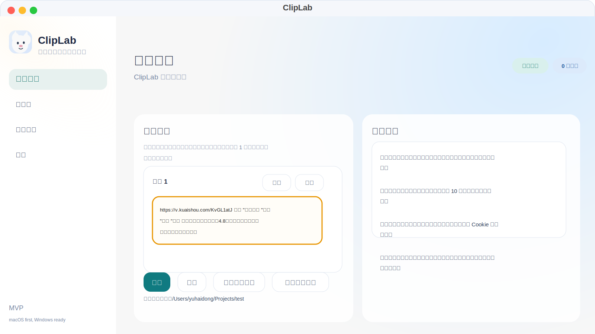

# ClipLab

[中文说明](./README.md)

ClipLab is a local-first desktop video utility focused on the workflow of “paste a share text -> extract the real video URL -> download the original video”. The current project targets `macOS` first, while keeping the project structure ready for future `Windows` packaging.

## Preview



## Features

- Extracts the real video URL from full share text
- Currently supported platforms: `Douyin`, `Kuaishou`
- Batch download inputs in the desktop app
- Dynamic “Add” button to append more input fields
- “Paste” button to read text directly from the system clipboard
- Uses the post title as the output filename
- Truncates titles after `10` Chinese characters
- Avoids overwriting by auto-renaming duplicate files
- Optional `Douyin Cookie` / `Kuaishou Cookie` fallback in Settings
- Manual watermark-area selection for local videos
- LAN `/remote` page for submitting download tasks from mobile devices
- SQLite-backed task/log persistence with SSE task updates

## Current Scope

- Only single-post downloads for Douyin and Kuaishou are implemented
- QR-code login is not implemented
- Download tries the no-login path first; cookies are only a fallback
- `Windows` packaging is prepared structurally, but the project is mainly developed and validated on `macOS`

## Tech Stack

- Desktop: `Electron`, `React 18`, `TypeScript`, `Vite`
- Backend: `Python 3.12`, `FastAPI`
- Tooling: `uv`, `ffmpeg`, `curl`
- Storage: `SQLite`

## Requirements

- `Node.js 22+`
- `Python 3.12+`
- `uv`
- `ffmpeg`
- `curl`

Recommended on macOS via Homebrew:

```bash
brew install node@22 python@3.12 uv ffmpeg curl
```

If you want `npm run dev:clean` to automatically reclaim old listeners, make sure `lsof` is available. On macOS it usually already is.

## Quick Start

### 1. Install frontend dependencies

```bash
npm install
```

### 2. Install backend dependencies

```bash
uv sync --project backend --extra dev
```

If you also want the fuller STTN runtime:

```bash
uv sync --project backend --extra dev --extra sttn
```

### 3. Start the desktop app in development mode

```bash
npm run dev
```

This starts:

- renderer build watch
- local FastAPI backend
- Electron compile watch
- Electron desktop app

### 4. Start in LAN mode

If you want mobile devices on the same network to access the submit page:

```bash
npm run dev:lan
```

### 5. Clean up stale dev processes

```bash
npm run stop
```

## Common Commands

```bash
npm run dev
npm run dev:lan
npm run lint
npm run build
npm run package
npm run stop
uv run --project backend --with pytest pytest -q backend/tests
```

## Usage

### Download videos

1. Open the `Download` page in the desktop app
2. Pick an output directory
3. Paste a share text or a direct URL
4. Click `Add` if you want more inputs
5. Click `Paste` if you want to read from the system clipboard
6. Click `Download`
7. Track progress in the `Tasks` page

Supported input forms include:

- direct URLs
- Douyin share text
- Kuaishou share text
- mixed text containing one valid supported URL

### Cookie fallback

No login is required by default.

If you hit platform restrictions, you can manually fill cookies in `Settings`:

- `Douyin Cookie`
- `Kuaishou Cookie`

QR login is intentionally not implemented.

### Watermark removal

1. Open the `Watermark Removal` page
2. Pick a local video
3. Drag to select the watermark area
4. Create the watermark-removal task

### Mobile / LAN submission

1. Start the app with `npm run dev:lan`
2. Open the `Settings` page in the desktop app
3. Use one of the displayed `remote` URLs
4. Submit a share text or URL from your phone browser

All mobile-submitted tasks go into the same local queue and show up in the desktop UI in real time.

## Filename Rules

- The output filename uses the post title first
- Illegal filesystem characters are cleaned automatically
- If the title has `10` or fewer Chinese characters, the full cleaned title is used
- If the title has more than `10` Chinese characters, it is truncated at the 10th Chinese character
- If the title becomes empty, ClipLab falls back to `<platform>_<resolvedId>.mp4`
- Duplicate names are auto-renamed with suffixes like ` (2)`, ` (3)`, and so on

## Project Structure

```text
ClipLab/
├─ electron/                    # Electron main process and preload
├─ src/                         # React renderer and shared types
├─ backend/
│  ├─ cliplab_backend/
│  │  ├─ services/              # resolvers, downloaders, task/model/watermark logic
│  │  ├─ storage/               # SQLite persistence
│  │  └─ main.py                # FastAPI entrypoint
│  └─ tests/                    # backend tests
├─ scripts/                     # development helper scripts
├─ docs/                        # README preview assets and documentation resources
├─ app-data/                    # runtime data directory (ignored)
└─ tmp/                         # local reference projects (ignored)
```

## Icon Location

Place your app icon here:

- `public/assets/icons/app-icon.png`

The app now uses that file for:

- the top-left brand icon
- the Electron window icon
- the macOS Dock icon

If you plan to package the app later, it is also a good idea to prepare:

- `public/assets/icons/app-icon.icns`
- `public/assets/icons/app-icon.ico`

## Environment Variables

Supported backend environment variables:

- `CLIPLAB_APP_DATA`
- `CLIPLAB_BACKEND_URL`
- `CLIPLAB_FFMPEG_PATH`
- `CLIPLAB_STTN_AUTO_MODEL_URL`
- `CLIPLAB_LAMA_MODEL_URL`
- `CLIPLAB_PID_FILE`

By default, runtime data is stored under `app-data/`, including:

- `cliplab.sqlite3`
- `logs/`
- `models/`
- default output directory `ClipLab/`

## Validation

### TypeScript / Electron type check

```bash
npm run lint
```

### Backend tests

```bash
uv run --project backend --with pytest pytest -q backend/tests
```

## Packaging

```bash
npm run build
npm run package
```

Packaging is handled by `electron-builder`:

- macOS: `dmg`
- Windows: `nsis`

## Verified Download Samples

The current code has already been validated locally with:

- the Douyin sample share text you provided
- the Kuaishou sample share text you provided

Both resolved and downloaded successfully as MP4 files.

## Troubleshooting

### `ffmpeg` not found

- install `ffmpeg`
- or set `CLIPLAB_FFMPEG_PATH`

### Douyin parse failure

- retry once
- if it still fails, fill in a Douyin cookie in Settings and try again

### Port `8765` is occupied

```bash
npm run stop
```

If needed, check whether another non-ClipLab service is using the port.

### `/remote` is not reachable on another device

- make sure you started with `npm run dev:lan`
- make sure both devices are on the same network
- make sure your firewall is not blocking port `8765`
